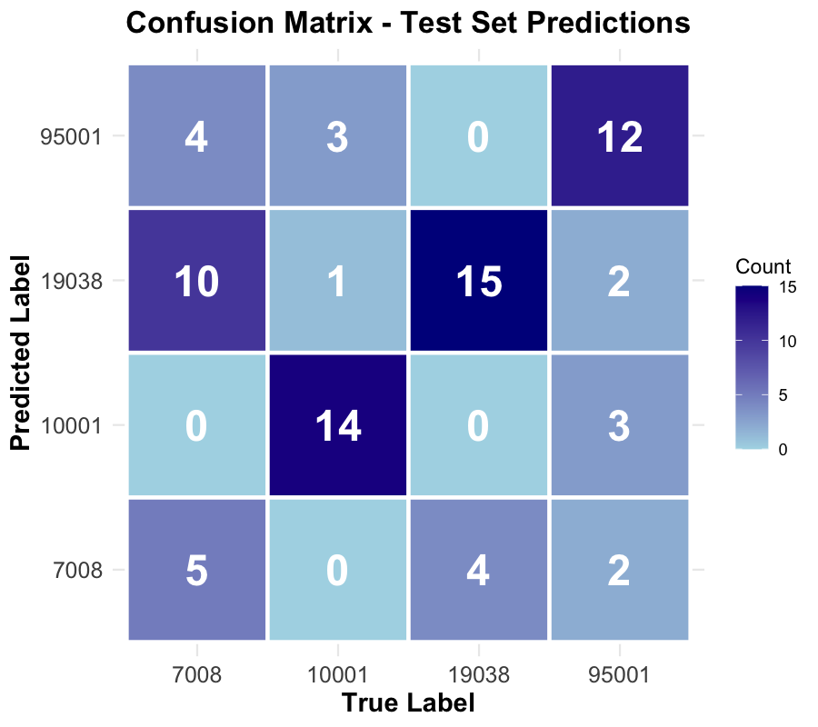
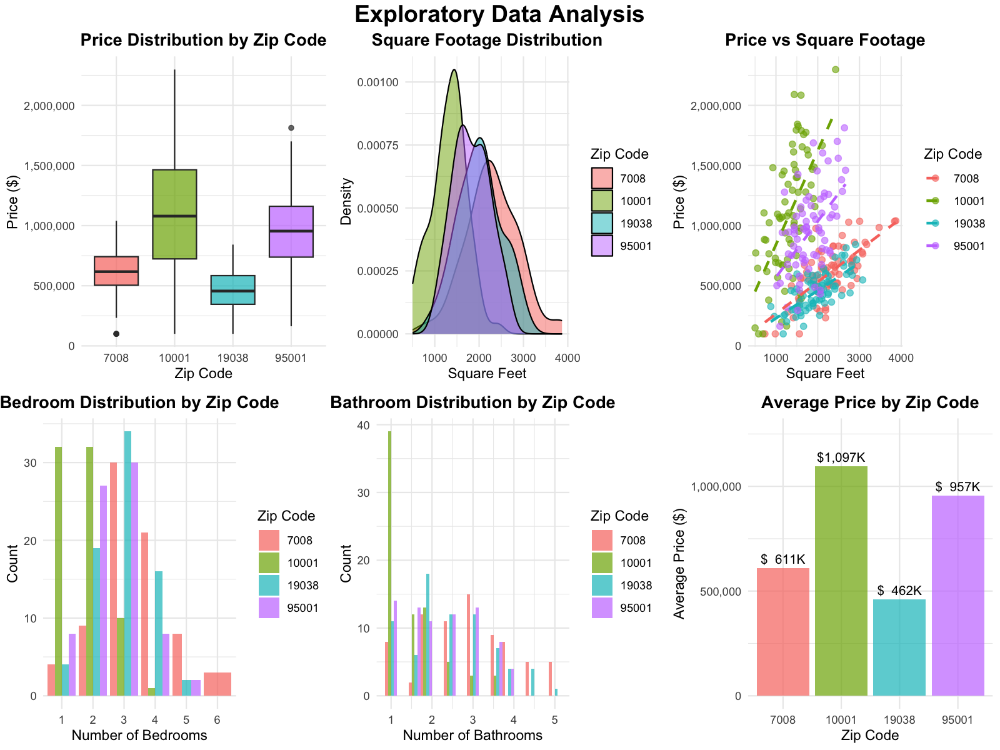

---

# **HouseClassificationRedfin**

## **Overview**

This repository contains a **cleaned, structured dataset of residential property sales** collected from Redfin for **four ZIP codes**. The dataset is suitable for **data analysis, visualization, and machine learning projects** related to the real estate market.

It includes key property features such as **sale price, sale date, property type, bedrooms, bathrooms, square footage, and year built**. All data has been normalized and missing values handled consistently to ensure reliability and usability.

---

## **Dataset Scope**

* **Source:** Redfin ([www.redfin.com](http://www.redfin.com))
* **Geographic Coverage:** 4 ZIP codes (user-defined)
* **Timeframe:** Most recent listings and historical sales available via Redfin pages
* **Number of Records:** Variable; includes all listings across the selected ZIP codes
* **Data Features:**

| Feature        | Description                                  |
| -------------- |----------------------------------------------|
| ZIP            | ZIP code of the property                     |
| Address        | Street address                               |
| Sale Price     | Final sale price (USD)                       |
| Sale Date      | Date of sale (YYYY-MM-DD)                    |
| Property Type  | Single Family, Condo, Townhouse, etc.        |
| Beds           | Number of bedrooms (1-6)                     |
| Baths          | Number of bathrooms (1-5)                    |
| SqFt           | Living area in square feet (500-4000)        |
| Year Built     | Year the property was built                  |
| Price per SqFt | Computed price per square foot ($100K-$2.3M) |

---

## **Project Structure**

```
├── data/                      # All data files
│   ├── house_data.csv        # Original data (300 records)
│   ├── house_data_cleaned.csv
│   ├── model_results.txt     # Performance metrics
│   ├── test_predictions.csv  # For R visualizations
│   ├── train_predictions.csv
│   └── model_coefficients.csv
│
├── visualizations/            # All plots
│   ├── eda_plots.png
│   ├── correlation_heatmap.png
│   ├── confusion_matrix.png
│   ├── feature_importance.png
│   ├── performance_metrics.png
│   └── price_per_sqft.png
│
├── data_collection.py         # Web scraping
├── model_python.py            # ML model
├── visualizations.R           # All plots 
└── requirements.txt           # Python packages
```

---

## 💻 Code Workflow

```
data_collection.py  →  data/house_data.csv
         ↓
model_python.py  →  data/*.csv, data/model_results.txt
         ↓
visualizations.R  →  visualizations/*.png
```

---

## **Data Collection Methodology**

1. **Scraping Redfin:**

   * The project uses Python (`requests` + `BeautifulSoup`) to extract data from Redfin ZIP code pages.
   * Pagination is implemented to scrape **all listings** per ZIP code.

2. **Data Cleaning and Normalization:**

   * Numeric features (`Sale Price`, `Beds`, `Baths`, `SqFt`, `Year Built`) are converted and missing values handled.
   * `Price per SqFt` is calculated automatically.

3. **Ethical Considerations:**

   * Scraping is performed **responsibly** for academic purposes.
   * Rate limiting (`time.sleep`) is used to avoid overloading the Redfin servers.
   * No personal or sensitive information is collected.

---

## **Dependencies**

* Python 3.9+
* `requests`
* `beautifulsoup4`
* `pandas`
* R 4.5.2
* `ggplot2`
* `reshape2`
* `gridExtra`


---

## 📊 Visualizations (R)

1. **EDA Plots** - Price, sqft, beds, baths distributions
2. **Correlation Heatmap** - Feature relationships
3. **Confusion Matrix** - Prediction errors
4. **Feature Importance** - Model coefficients
5. **Performance Metrics** - Precision, Recall, F1
6. **Price per Sqft** - Market efficiency


---

## **Potential Applications**

* Real estate price analysis by ZIP code
* Predictive modeling (house price prediction)
* Comparative market studies
* Data visualization (heatmaps, trends, histograms)

---

## **License**

This project is for **educational and research purposes**. Data is scraped from publicly available Redfin listings and intended for **non-commercial use**.

---

## 🤖 Model Results

```
Test Accuracy: 61.33%
Training Accuracy: 70.22%
Cross-Validation: 67.11% ± 15.24%
```

**Best Performance:** Manhattan (10001) - 80% F1  
**Worst Performance:** NJ Suburban (07008) - 33% F1

### Why Manhattan Works Well
- High prices (+3.04 coefficient)
- Small units (-4.12 sqft coefficient)
- Unique urban signature

### Why Suburbs Confuse
- Similar price ranges
- Similar house sizes
- Missing geographic features

---

## 📈 Key Findings

1. **Price** is most discriminative feature
2. **Square footage** separates urban from suburban
3. **61% accuracy** is 2.4× better than random (25%)
4. Need location data (lat/lon) to improve further
---

## Confusion Matrix

A heatmap visualizing the performance of a classification model with distinct zip codes.

## Correlation Heatmap

A heatmap visualizing the relationships between features.

## Feature Importance

A grouped bar chart visualizing the most important features in the model.

## Price per SqFt

A side-by-side comparison of the price per square foot across zip codes.


## Performance Metrics

A bar chart visualizing the performance of the model on each zip code, evaluated using precision, recall, and F1.

## EDA Plots

A six-panel visualization suite examining the relationship between price, square footage, bedrooms, bathrooms, and year built.
